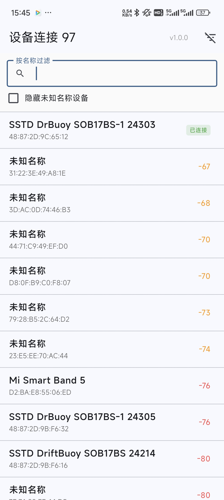
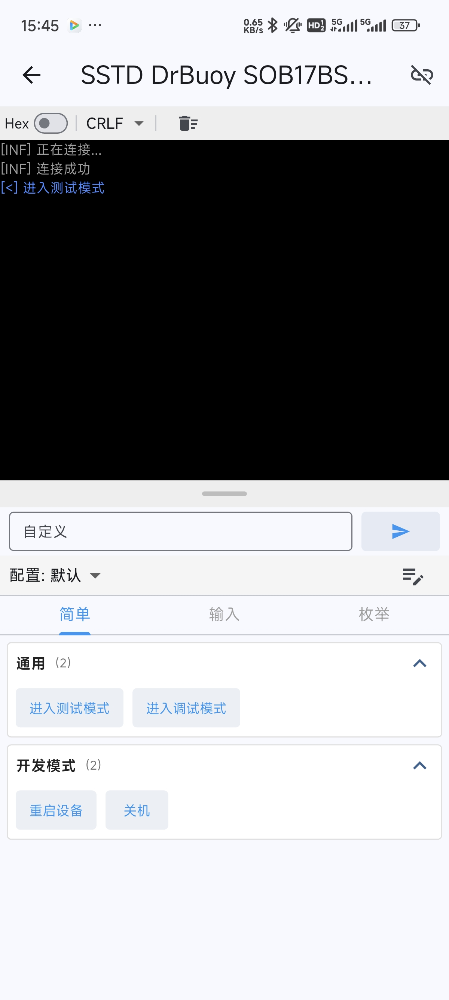
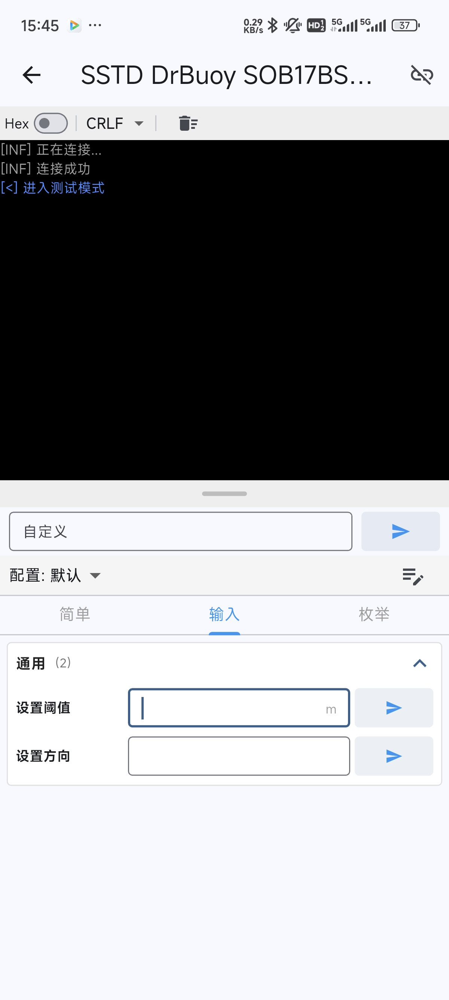
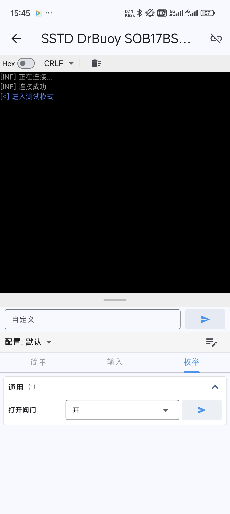
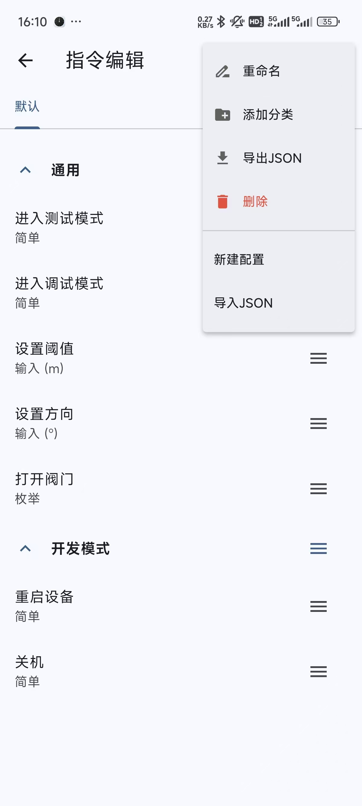
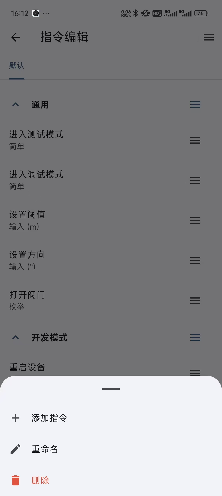

# BlueTerm (通用 BLE 调试助手)

一个通用的低功耗蓝牙（BLE）调试工具。

本项目诞生的初衷是为了解决 **DX-BT24** (深圳大夏龙雀科技有限公司) 的蓝牙串口模块官方 App 功能简陋、难以满足专业调试需求的问题。本应用致力于在移动端还原 PC 端串口调试助手（如 SSCOM）的高效体验，支持自定义指令组、复杂的参数配置以及配置文件的便捷分享。

## ✨ 核心功能

### 桌面级的串口调试体验
* **分组管理**：支持创建指令分组，分类管理大量调试指令，界面整洁有序。
* **多类型指令支持**：
    * **简单指令 (Simple)**：发送固定的字符串或 HEX 数据（如固定的 AT 指令）。
    * **可输入指令 (Input)**：支持配置“前缀 + 用户输入数据 + 后缀”，发送时动态组合，适合调试需要变参的协议。
    * **枚举指令 (Enum)**：通过上下文菜单（Context Menu）选择预设动作（如“开灯”、“关灯”），无需记忆复杂指令。
* **协议友好**：
    * 支持 HEX (十六进制) 发送/接收。
    * 支持自动追加回车换行 (CR/LF)。
    * **Modbus CRC16**：在 HEX 模式下，支持自动计算并追加 Modbus CRC16 校验码。

### 设备连接
* **名称过滤**：扫描时支持输入设备名称关键字进行过滤，快速定位目标设备。
* **连接稳定性**：针对 SPP-over-BLE 进行了优化。

## 🛠️ 硬件与协议说明

工具的定位是通用的 BLE 调试助手，目前仅默认针对 **DX-BT24** 的透传模块进行了适配，如果要适配其他模块，可以自己下载代码修改。

### 默认服务 UUID 配置
App 通过以下特征值实现类似 SPP (Serial Port Profile) 的数据透传：

| 功能        | UUID   | 说明                       |
| :---------- | :----- | :------------------------- |
| **Service** | `FFE0` | 主服务 UUID                |
| **Notify**  | `FFE1` | 用于接收设备数据的特征值   |
| **Write**   | `FFE2` | 用于向设备发送数据的特征值 |

> *注：以上 UUID 为 DX-BT24 默认配置，连接兼容该服务的模块即可直接通讯。*

## 📖 使用指南

### 扫描与连接
启动 App，授予蓝牙权限。在搜索栏输入设备名称（可选）进行过滤，点击列表中的设备进行连接。

### 指令类型详解

#### A. 简单指令 (Simple Command)
最基础的指令，点击即发送。
* 

#### B. 可输入指令 (Input Command)
允许在发送前输入数据。
* 

#### C. 枚举指令 (Enum Command)
定义一组相关的操作。
* 

### 配置指令
本 App 的核心在于“先配置，后使用，点击配置按钮跳转到指令编辑界面。
* 

1.  **新建分组**：点击左上角的添加分组。
2.  **添加指令**：点击对应分组右边的菜单按钮。
* 
3.  **编辑指令**：点击对应指令右边的菜单按钮送。
* 

## 📥 导入与导出

可以将配置好的指令集分享给其他人：
* **剪贴板导入**：直接复制 JSON 字符串即可导入配置。
* **JSON 导出**：可导出为 JSON 字符串至剪贴板，方便保存到电脑。
* **URL 导入**：支持将配置文件托管在静态文件服务器，App 内输入 URL 即可一键导入调试配置。

## 🤝 贡献与反馈
如果您发现有其他 BLE 模块的 UUID 需要适配，也可以告诉我。

---